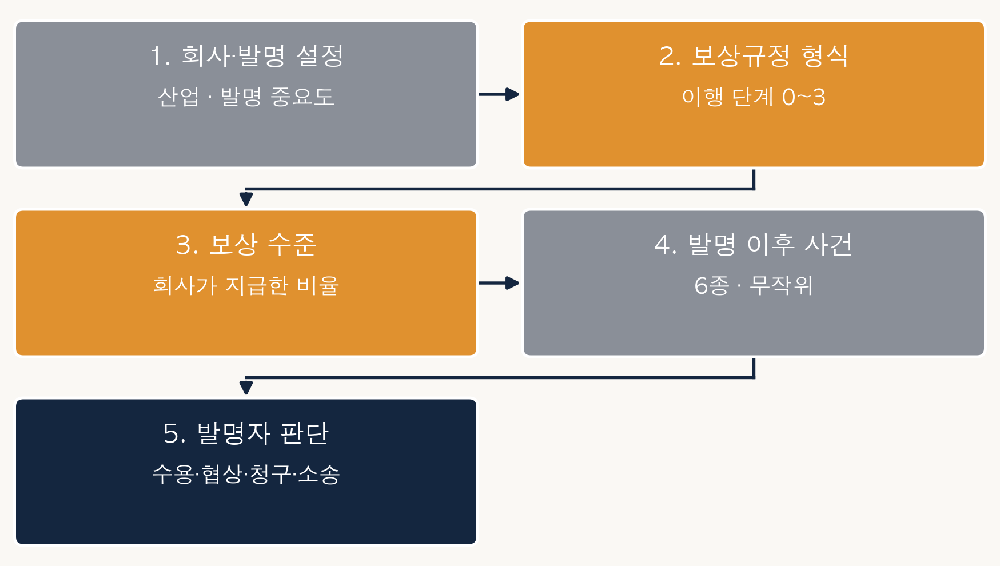
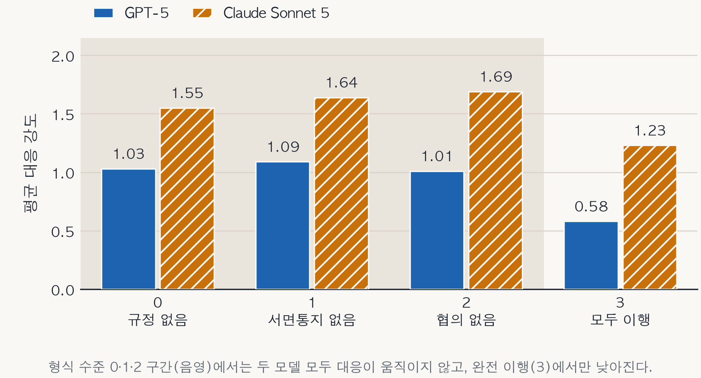

# 직무발명 분쟁 대응 시뮬레이션 (LLM 에이전트)

한국 발명진흥법 제15조의 보상규정 절차 요건이 종업원 발명자의 분쟁 대응에 미치는 효과를
LLM 에이전트 시뮬레이션으로 검증한 연구의 코드와 데이터입니다.

논문: 「직무발명 분쟁 대응의 결정요인: 두 언어모델을 이용한 에이전트 시뮬레이션」
(지식경영연구 투고 중)

## 무엇을 하는가

하나의 LLM 에이전트가 한국 기업의 종업원 발명자 역할을 맡습니다. 규칙 기반 환경이 산업,
발명 중요도, 회사의 절차 준수 수준(보상규정 형식 0~3), 지급된 보상 수준을 먼저 정해 놓고,
특허 이후에 사건(사업화 성공·M&A·라이선스·이직 제안·침해소송 승소·무효소송 승소)이
일어나 회사 이익이 달라집니다. 발명자는 **수용 < 협상요청 < 청구 < 소송** 가운데 하나를
고르고, 왜 그렇게 판단했는지를 함께 적습니다.

형식 4단계 × 보상 4단계 × 인지 모드 2종 = 32개 조합에 16건씩 층화 배정하여 모델당 512건을
만들었고, 같은 설계를 **GPT-5**와 **Claude Sonnet 5** 두 모델에서 각각 실행했습니다.

## 정본 실행분

| 파일 | 모델 | N | 비고 |
|---|---|---|---|
| `outputs/sim_results_v12_gpt5.csv` | gpt-5-2025-08-07 | 512 | 재시도 0, 유실 0 |
| `outputs/sim_results_v12_claude.csv` | claude-sonnet-5 | 512 | 재시도 46, 유실 0 |

논문의 모든 수치는 **이 두 파일에서만** 나옵니다. 이전 판본과 스모크 테스트 실행분은 설계가
달라 비교 대상이 아니므로 이 저장소에 두지 않습니다. 실행 조건은 각 `*_manifest.json`에
있습니다(모델, 시드, 셀별 실현 수, 재시도·유실 건수).

## 재현하기

```bash
pip install pandas statsmodels matplotlib

# 논문의 표 2·3·4·5를 정본 CSV에서 그대로 다시 계산한다
python analysis/reproduce_tables.py

# 그림(형식 수준별 평균 대응 강도)을 다시 그린다 → figures/fig2_formality.png
python analysis/make_fig_formality.py
```

두 스크립트 모두 정본 CSV 파일명을 코드에 고정해 두었습니다. 이름순으로 마지막 CSV를 집어
표와 그림이 어긋나는 사고를 막기 위해서입니다.

시뮬레이션을 처음부터 다시 돌리려면 API 키가 필요합니다.

```bash
cp .env.example .env      # 키를 채운다
python parallel_run.py --config config_full.json
```

`.env`는 저장소에 없습니다. OpenAI 백엔드는 `OPENAI_API_KEY`를, Claude 백엔드는 로컬
Claude CLI를 씁니다(`LLM_BACKEND=claude`).

## 설계를 더 알고 싶다면

**[docs/simulation.md](docs/simulation.md)** 에 에피소드 진행, 세 설계 요인, 금액 계산식,
그림, CSV 데이터 사전, 실행 조건, 그리고 검증 과정에서 무엇을 왜 덜어냈는지까지 적어
두었습니다. 코드를 열지 않고도 설계를 확인할 수 있습니다.



형식 수준 0·1·2에서는 두 모델 모두 대응이 거의 움직이지 않고, 완전 이행(3)에서만 낮아집니다.



## 파일 안내

| 파일 | 내용 |
|---|---|
| `env.py` | 규칙 기반 환경. 시나리오 생성, 층화 배정, 사용자 이익·정당보상 계산 |
| `agents.py` | 발명자 에이전트. **프롬프트 전문(조문·판례·감정 목록)이 여기 있습니다** |
| `llm_backend.py` | OpenAI / Claude CLI 백엔드 |
| `parallel_run.py` | 실행 루프. 증분 저장·재개, 셀별 실현 수 점검 |
| `diagnose.py` | 실행 직후 분포·가설 방향 점검 |
| `docs/simulation.md` | 설계 해설과 데이터 사전 |
| `figures/` | 논문에 실린 그림 4장 |
| `ANALYSIS_PLAN_FROZEN.md` | 실행 전에 고정한 분석 계획 |
| `FROZEN_CHECKSUMS.txt` | 고정 시점의 코드 해시와 이후 변경 이력 |

## 설계에서 일부러 하지 않은 것

프롬프트가 결과를 특정 방향으로 몰지 않도록 다음을 지켰습니다. `agents.py`에서 직접
확인할 수 있습니다.

- 회사의 절차 준수 수준은 **사실 서술로만** 전달합니다. 예컨대 수준 2는 "보상규정을 서면으로
  알렸으나 작성·변경 시 종업원과 협의한 적 없음"이며, 그것이 법적 요건을 충족하는지에 대한
  평가는 붙지 않습니다. 제6항 추정이 성립하는지는 에이전트가 조문을 읽고 스스로 판단합니다.
- 네 선택지 가운데 무엇이 유리하다는 안내가 없습니다. 두 인지 모드가 같은 문구를 봅니다.
- 어떤 상황에서 어떤 감정을 고르라는 매핑이 없습니다. 여덟 감정은 상태 자체로만 정의됩니다.
- 정당보상의 '정답' 금액을 주지 않습니다. 숙고 모드에도 판례상 공헌도 10~20%의 **범위**만
  제공하며, 계산은 에이전트 몫입니다.

직관적 처리(S1)와 숙고적 처리(S2)의 정보 차이는 통제해야 할 오염이 아니라 이중처리 이론의
두 체계를 구현하기 위해 의도한 조작입니다.

## 파라미터의 근거

정당보상 추정액은 `사용자 이익 × 발명자 공헌도 × 청구인 지분`으로 계산하며, 각 값은 대법원
판례에 맞췄습니다.

- 사용자 이익의 개념: 2009다75178
- 발명자 공헌도 15%: 2009다91507
- 청구인 지분 100%: 2014다220347
- 산업별 실시료율: 정보통신 2%(2014다220347), 농약 3%(2009다75178), 제약 5%(2009다91507).
  제조 3%와 반도체 3%는 직접 인정한 판례가 없는 **가정치**입니다.

기준 매출액과 독점권 기여율은 에피소드마다 난수로 뽑으므로, 개별 에피소드의 사용자 이익은
실측값이 아니라 판례가 인정한 범위 안에서 생성한 **합성값**입니다.

## 알아 두실 점

- 수용률·소송률 같은 **절대 빈도는 현실의 추정치가 아닙니다.** 두 모델에서 크게 갈리며
  (수용률 33.8% 대 4.5%, 소송률 0% 대 20.3%) 모델의 기질을 반영한 값입니다. 논문도 이를
  결과로 보고하지 않습니다.
- 논문이 결과로 다루는 것은 조건이 대응에 미치는 **상대적·방향적 효과**, 그리고 그 효과가
  두 모델에서 일관되는지 갈라지는지입니다.
