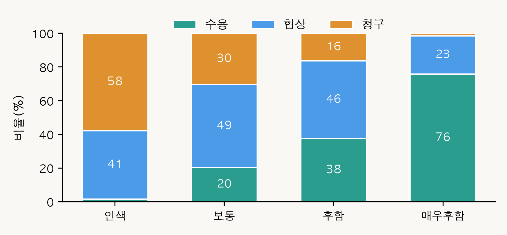
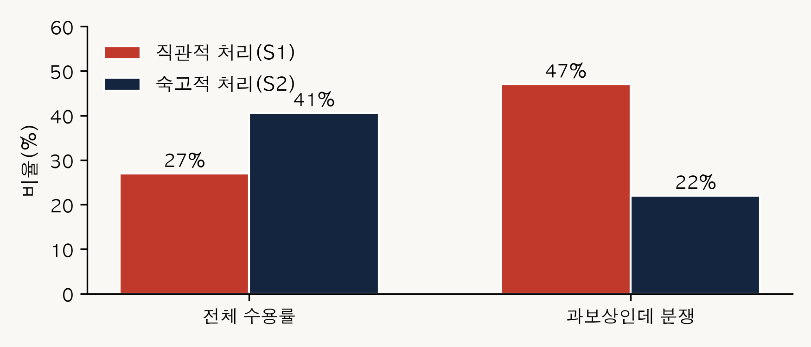

# 시뮬레이션 설계 설명

이 문서는 코드를 열지 않고도 시뮬레이션이 무엇을 하는지 알 수 있도록 설계를 풀어 적은
것입니다. 프롬프트 전문은 `agents.py`, 환경 규칙은 `env.py`에 있습니다.

## 1. 한 에피소드의 진행

에피소드는 이 시뮬레이션의 기본 단위입니다. 하나의 가상 직무발명 분쟁이 처음부터 끝까지
한 번 돌아가는 것을 말하며, 모델마다 512번 반복했습니다.


| 단계 | 하는 일 | 언어모델 호출 |
|---|---|---|
| 1. 환경 설정 | 산업, 발명 중요도, 앞으로 닥칠 사건 유형을 뽑는다 | 없음 |
| 2. 보상규정 설정 | 회사의 절차 준수 수준(형식 0~3)을 배정한다 | 없음 |
| 3. 초기 보상 지급 | 규칙에 따라 발명자에게 줄 초기 보상을 확정한다 | 없음 |
| 4. 외부 사건 발생 | 사건이 일어나 회사 이익이 충격배율만큼 달라진다 | 없음 |
| 5. 정당보상 재계산 | 달라진 이익으로 정당보상을 다시 구하고 격차를 낸다 | 없음 |
| 6. 발명자 판단 | 발명자가 대응 하나를 고르고 이유를 적는다 | **1회** |
| 7. 결과 기록 | 조건·결과·추론 기록을 CSV 한 줄로 저장한다 | 없음 |

핵심은 **6단계 전에 모든 조건이 이미 확정된다**는 점입니다. 발명자의 선택이 조건을 거꾸로
바꾸는 일이 없으므로, 나중에 "조건이 대응을 낳았다"고 말할 수 있습니다. 언어모델을 부르는
곳도 6단계 하나뿐이라, 관측된 변이가 어디서 왔는지가 분명합니다.

## 2. 설계 요인 세 가지

연구자가 값을 미리 정해 고르게 나눠 담은 요인입니다(층화 배정).

### 형식 수준 (0~3) — 회사가 법이 정한 절차를 얼마나 지켰는가

발명진흥법 제15조 제2항부터 제4항까지의 누적 이행 정도입니다. 프롬프트에는 아래 문장이
**사실 서술 그대로** 들어가며, 법적 평가는 붙지 않습니다.

| 수준 | 프롬프트에 들어가는 문장 | 빠진 요건 |
|---|---|---|
| 0 | 보상규정 자체가 없음 | 제2~4항 전부 |
| 1 | 보상규정은 있으나 종업원에게 서면으로 알린 적 없음 | 제2항 |
| 2 | 보상규정을 서면으로 알렸으나 작성·변경 시 종업원과 협의한 적 없음 | 제3항 |
| 3 | 보상규정을 서면으로 알렸고, 작성 시 종업원과 협의했으며, 결정된 보상액도 서면으로 알림 | 없음 |

수준 3이 특별한 이유는 제15조 제6항 때문입니다. 제6항은 제2~4항을 **모두** 이행한 경우에만
"정당한 보상을 한 것으로 본다"는 추정을 부여합니다. 따라서 0·1·2는 법적으로 같은 처지이고,
3에서만 추정이 열립니다. 다만 제6항 단서는 그 금액이 회사 이익과 공헌도를 고려하지 않은
것이면 추정을 거둡니다. 이 본문과 단서의 긴장이 두 모델을 갈라놓았습니다.


### 보상 수준 (0~3) — 회사가 얼마나 후하게 줬는가

인색·보통·후함·매우후함의 네 단계입니다. **외부 사건이 일어나기 전에 확정**되므로, 사건으로
회사 이익이 크게 뛰면 인색한 쪽일수록 정당보상과의 격차가 크게 벌어집니다.



### 인지 모드 (S1 / S2) — 발명자가 어떤 근거를 손에 쥐고 있는가

이중처리 이론의 두 체계를 정보량의 차이로 구현했습니다.

| | 직관적 처리 (S1) | 숙고적 처리 (S2) |
|---|---|---|
| 상황 정보 | 제공 | 제공 (동일) |
| 발명진흥법 제15조 조문 | 없음 | 제1~4항·제6항 전문 |
| 대법원 판례 요지 | 없음 | 4건 |
| 공헌도 기준 | 없음 | 판례상 10~20% **범위** |
| 청구·소송의 시간·비용 | 없음 | 제공 |
| 과업 지시 | "지금 드는 느낌대로 곧바로 결정" | "각 요소를 순서대로 하나씩 검토한 뒤 결정" |

이 정보 차이는 통제해야 할 오염이 아니라 **조작 그 자체**입니다. 양쪽에 조문을 똑같이 주고
한쪽에만 "쓰지 말라"고 지시하는 방식은 성립하지 않습니다(실측에서 직관 모드도 조문을 78.5%
인용했습니다). 그래서 정보 접근 자체를 갈랐습니다.



## 3. 돈은 어떻게 계산되는가

```
사용자 이익(기초) = 기준 매출액 × 산업별 실시료율 × 독점권 기여율
사용자 이익(충격 후) = 사용자 이익(기초) × 충격배율
정당보상 추정액 = 사용자 이익(충격 후) × 발명자 공헌도(15%) × 청구인 지분(100%)
격차 = 정당보상 추정액 − 실지급액 합계
```

- **실시료율**: 매출 가운데 특허 사용료로 보는 비율. 정보통신 2%(2014다220347),
  농약 3%(2009다75178), 제약 5%(2009다91507). 제조 3%·반도체 3%는 직접 인정한 판례가 없는
  **가정치**입니다.
- **독점권 기여율**: 그 이익 가운데 특허로 경쟁자를 막은 덕분인 몫. 에피소드마다 난수.
- **발명자 공헌도 15%**: 2009다91507이 인정한 발명 보상률.
- **청구인 지분 100%**: 단독발명. 2014다220347.
- **충격배율**: 사건이 회사 이익을 몇 배로 키웠는지. 유형별 범위에서 균등 샘플링.

기준 매출액과 독점권 기여율이 난수이므로 개별 에피소드의 금액은 실측값이 아니라 **판례가
인정한 범위 안에서 생성한 합성값**입니다. 절대 금액을 현실의 추정치로 읽으면 안 됩니다.

격차가 음수면 **과보상**(이미 정당보상보다 많이 받음), 양수면 **과소보상**입니다.

## 4. 외부 사건 여섯 가지

사업화 성공 · 인수합병(M&A) · 라이선스 수입 · 이직 제안 · 침해소송 승소 · 무효소송 승소.
발명 이후에 그 발명의 가치를 실제로 끌어올리는 대표적 사건들이며, 각각 국내 실증 연구에
근거를 둡니다(사업화 성공은 이재헌 외 2024, 무효소송은 이정영·문춘걸 2020, 침해소송은
심미랑·김현 2025).

이 판본에서 사건 유형은 층화 요인이 아니라 무작위 배정입니다. 따라서 유형별 효과는
확정적으로 해석하지 않습니다.

## 5. 결과 변수

발명자는 넷 중 하나를 고릅니다. 뒤로 갈수록 되돌리기 어렵고 비용이 큽니다.

```
수용(0) < 협상요청(1) < 청구(2) < 소송(3)
```

이 순서를 **대응 강도**라 부르고 순서형 로지스틱 회귀로 분석합니다. 간격이 같다고 볼 수 없는
순서형 값이므로 평균을 내는 보통의 회귀는 쓰지 않습니다.

## 6. 데이터 사전 (CSV 컬럼)

`outputs/sim_results_v12_*.csv` 한 줄이 에피소드 하나입니다.

| 컬럼 | 뜻 |
|---|---|
| `에피소드ID` | 일련번호 |
| `산업` | 정보통신·제약·제조·반도체·농약 등 |
| `발명중요도` | 미미·보통·중요·핵심 등. 기준 매출액 승수에 반영 |
| `보상규정형식레벨` | 0~3. **설계 요인** |
| `보상규정형식설명` | 프롬프트에 실제로 들어간 문장 |
| `보상비율수준` | 0~3(인색~매우후함). **설계 요인** |
| `보상비율라벨` | 위 수준의 이름 |
| `보상비율실현값` | 실제로 적용된 배율 |
| `인지모드` | S1 / S2. **설계 요인** |
| `실시료율` | 산업별. 판례 준거 |
| `기준매출만원` | 난수 + 중요도 승수 |
| `독점권기여율` | 난수 |
| `출원·등록·실시보너스만원` | 단계별 지급액 |
| `실지급액합계만원` | 위 셋의 합. 발명자가 실제로 받은 돈 |
| `충격유형` | 외부 사건 6종 중 하나 |
| `충격배율` | 이익이 몇 배가 되었는가 |
| `사용자이익기초만원` | 사건 이전 |
| `사용자이익충격후만원` | 사건 이후. 프롬프트에 이 값이 제시된다 |
| `충격전정당보상만원` | 참고용 |
| `정당보상추정만원` | 사건 이후 기준. **프롬프트에는 주지 않는다** |
| `격차만원` | 정당보상 − 실지급. 음수면 과보상 |
| `발명자결정` | 수용/협상요청/청구/소송. **종속변수** |
| `감정동인` | 결정 뒤 스스로 고른 감정 8종 중 하나 |
| `발명자이유` | 추론 기록. 왜 그렇게 판단했는지 |
| `최종결과` | 결정과 같음 |
| `재시도횟수` | 응답 파싱 실패로 다시 부른 횟수 |

`정당보상추정만원`은 분석용으로만 기록되고 **에이전트에게는 주지 않습니다**. 정답을 건네면
결정이 뺄셈 부호의 함수가 되어 버리기 때문입니다(초기 실행에서 실제로 64/64 일치가 났습니다).
숙고 모드에는 공헌도 10~20% 범위만 주고 계산은 에이전트에게 맡깁니다.

## 7. 실행 조건

| | GPT-5 | Claude Sonnet 5 |
|---|---|---|
| 모델 | gpt-5-2025-08-07 | claude-sonnet-5 |
| 백엔드 | OpenAI API | 로컬 Claude CLI (headless) |
| 시드 | 20250807 | 20250807 |
| 동시 실행 | 8 | 8 |
| 요청/실현 | 512 / 512 | 512 / 512 |
| 재시도 | 0 | 46 |
| 유실 | 0 | 0 |

temperature는 두 모델 모두 기본값입니다. 같은 조건에서도 답이 어느 정도 갈리도록 두었습니다.
사람도 같은 처지에서 다른 선택을 하기 때문입니다.

## 8. 설계에서 덜어낸 것들

초기 판본에는 있었으나 검증 과정에서 제거한 것입니다. 왜 뺐는지가 설계 판단의 기록이므로
남겨 둡니다.

- **변호사 에이전트**: 권고가 비구속이라 어떤 가설에도 기여하지 않으면서 실행 비용의 약 52%를
  차지했습니다. 상호작용이 없어 '다중 에이전트'라는 서술도 성립하지 않았습니다.
- **인사·IP 관리자 에이전트**: 규칙 기반 산술이라 언어모델 호출이 없었습니다. 이제 환경이
  직접 계산합니다.
- **기업 규모**: 어느 가설도 쓰지 않는데 규모 계층과 교락되고, 프롬프트에 노출되어 통제되지
  않은 행동 단서가 되었습니다.
- **감정 정의문의 조건어**: "절차 무시·보상 저평가에 대한 분노"처럼 조건과 감정을 잇는
  문구가 있었습니다. 실측에서 형식 0~1의 분노 선택률 48.9% 대 형식 2~3의 17.2%로, S1의 형식
  효과가 사실상 전부 이 정의문을 경유했습니다. 조건어를 지우고 감정을 상태 자체로만
  정의했습니다.
- **선택지 설명의 평가적 수식**: "소송(격차가 크고 절차 하자 명확 시 최후 수단)" 같은 문구가
  남아 있었습니다. 두 모드가 같은 무수식 문구를 보도록 통일했습니다.
- **지연이자 판례(2023다287168)**: '이자는 소를 제기해야 붙는다'는 내용이어서 소 제기 유인으로
  작동했습니다.
- **정당보상 점추정 제공**: 위 6절 참조.
